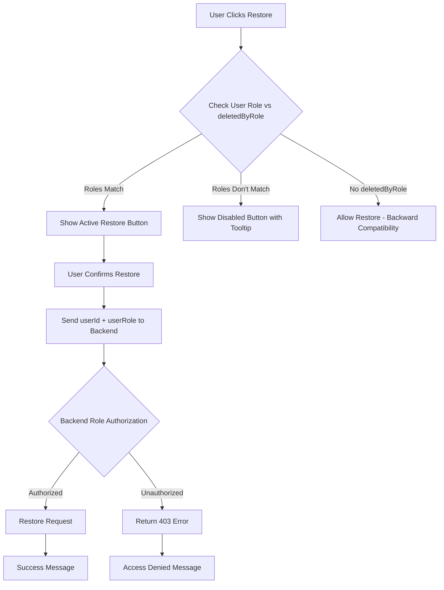

# Role-Based Restore Permissions Implementation

## Overview
This enhancement adds role-based authorization to the restore functionality, ensuring that only users with the same role as the person who deleted a request can restore it. This provides enhanced security and proper access control for the audit system.

## What Was Implemented

### 1. Backend Authorization (restoreDeletedRequest)
**File**: `c:\Users\Suresh\Desktop\sltnew1\tyreManagement-backend\controllers\requestController.js`

Enhanced the `restoreDeletedRequest` function with:
- **Role Parameter**: Accepts `userRole` from frontend along with `userId`
- **Authorization Logic**: Compares requesting user's role with `deletedByRole` from backup
- **Access Control**: Returns 403 error if roles don't match
- **Detailed Logging**: Enhanced logging with role information for debugging
- **Error Responses**: Specific error messages indicating required role

```javascript
// Role-based authorization check
if (backupRequest.deletedByRole && userRole) {
  if (backupRequest.deletedByRole !== userRole) {
    return res.status(403).json({ 
      success: false,
      message: `Access denied: Only users with '${backupRequest.deletedByRole}' role can restore this request`,
      deletedByRole: backupRequest.deletedByRole,
      userRole: userRole
    });
  }
}
```

### 2. Frontend Role Transmission
**File**: `c:\Users\Suresh\Desktop\sltnew1\tyreManagement-frontend\src\components\DeletedRequestsTable.tsx`

Updated the restore request to send user role:
```javascript
body: JSON.stringify({
  userId: user?.id,
  userRole: user?.role,  // NEW: Send user's role
})
```

### 3. UI Authorization Logic
Added helper functions for role-based UI control:

#### `canUserRestoreRequest(request: DeletedRequest)`
- Checks if current user's role matches the `deletedByRole`
- Returns `true` for backward compatibility if no role is tracked
- Enables/disables restore functionality based on role matching

#### `getRestoreTooltip(request: DeletedRequest)`
- Provides contextual tooltip messages
- Shows permission requirements
- Explains why restore is disabled for unauthorized users

### 4. Visual Indicators
Updated restore button rendering:
- **Enabled Button**: Green, clickable when user has proper role
- **Disabled Button**: Gray, non-clickable with explanatory tooltip
- **Tooltip Messages**: Role-specific explanations

```javascript
// Authorized users see active button
{canUserRestoreRequest(request) && (
  <button className="text-green-600 hover:text-green-900">
    <RotateCcw />
  </button>
)}

// Unauthorized users see disabled button with explanation
{!canUserRestoreRequest(request) && (
  <button disabled className="text-gray-400 cursor-not-allowed">
    <RotateCcw />
  </button>
)}
```

### 5. Enhanced Error Handling
Improved error messaging for role-based authorization failures:
- **403 Errors**: Special handling with detailed role information
- **User Feedback**: Clear explanation of access requirements
- **Role Display**: Shows both current user role and required role

## Role Mapping

| Role | Can Restore Requests Deleted By |
|------|--------------------------------|
| **user** | Users only |
| **supervisor** | Supervisors only |
| **technical-manager** | Technical Managers only |
| **engineer** | Engineers only |
| **customer-officer** | Customer Officers only |

## Security Benefits

### 1. **Role Segregation**
- Prevents cross-role restoration abuse
- Maintains proper authorization boundaries
- Ensures role-based access control consistency

### 2. **Audit Trail Integrity**
- Preserves deletion audit trail authenticity
- Prevents unauthorized data manipulation
- Maintains proper chain of custody

### 3. **Access Control**
- Only authorized roles can reverse deletions
- Prevents privilege escalation through restore functionality
- Maintains proper administrative boundaries

## User Experience

### 1. **Clear Visual Feedback**
- Enabled buttons for authorized users
- Disabled buttons with explanatory tooltips for unauthorized users
- Role-specific messaging in confirmation dialogs

### 2. **Informative Error Messages**
```
Access Denied: Only users with 'supervisor' role can restore this request.

Only Supervisors can restore this request (deleted by Supervisor)

Your current role: 'user'
```

### 3. **Confirmation Dialog Enhancements**
Added amber notification box explaining role-based security:
```
Role-based Security: Only users with the same role as the person who deleted this request can restore it. This request was deleted by a Supervisor, so only Supervisors can restore it.
```

## Backward Compatibility

### 1. **Legacy Deletions**
- Requests deleted before role tracking remain restorable by all users
- No disruption to existing functionality
- Graceful handling of missing `deletedByRole` data

### 2. **Migration Safety**
- No breaking changes to existing API contracts
- Optional role parameter maintains compatibility
- Existing frontends continue to work without role transmission

## Implementation Flow



## Testing Scenarios

### 1. **Same Role Restoration**
- Supervisor deletes request → Supervisor can restore ✅
- Engineer deletes request → Engineer can restore ✅

### 2. **Cross-Role Prevention**
- Supervisor deletes request → User cannot restore ❌
- Engineer deletes request → Customer Officer cannot restore ❌

### 3. **Legacy Compatibility**
- Request deleted before role tracking → Any user can restore ✅
- Missing `deletedByRole` data → Graceful fallback ✅

### 4. **UI Feedback**
- Authorized user sees green restore button with standard tooltip
- Unauthorized user sees gray disabled button with role explanation
- Role-specific confirmation dialog messaging

## Related Files Modified

### Backend
- `c:\Users\Suresh\Desktop\sltnew1\tyreManagement-backend\controllers\requestController.js`
  - Enhanced `restoreDeletedRequest` function with role authorization

### Frontend
- `c:\Users\Suresh\Desktop\sltnew1\tyreManagement-frontend\src\components\DeletedRequestsTable.tsx`
  - Added role-based UI authorization logic
  - Enhanced restore button conditional rendering
  - Improved error handling and user feedback
  - Added role-specific tooltips and confirmation dialog

## Configuration

No additional configuration required. The feature:
- Uses existing user role information from `AuthContext`
- Leverages existing `deletedByRole` column in `requestbackup` table
- Works with current authentication system
- Maintains all existing functionality

## Monitoring & Debugging

### Backend Logs
```
🔄 Starting restoration of deleted request ID: 123
👤 Restoration requested by user ID: 456, role: user
🚫 Access denied: User role 'user' cannot restore request deleted by role 'supervisor'
```

### Frontend Console
```
🔄 Attempting to restore request ID: 123
📡 Restore response status: 403
📦 Restore response data: { success: false, message: "Access denied...", deletedByRole: "supervisor", userRole: "user" }
```

This implementation provides robust role-based security for the restore functionality while maintaining backward compatibility and clear user feedback.